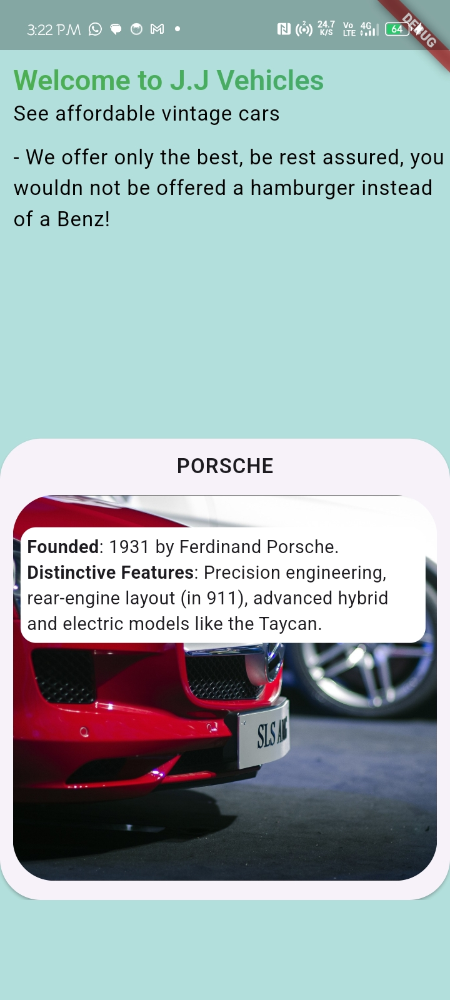
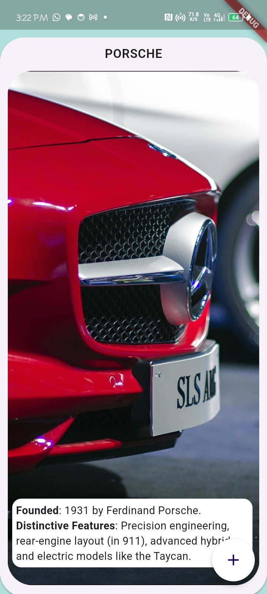

<div align="center">
   

## Slide Animations

<strong> A PageView slide animation extracted from a work I did for my clients.</strong>

<br/>
[Dribbble link](https://dribbble.com/shots/25288750-Tasks) <br/>
[Get APK here](https://drive.google.com/drive/folders/19rPMzMpCHUe5Tllrf6ZFekBKlLw468Sh?usp=drive_link)

<sub>Built by <a href="https://twitter.com/_Captured_Heart">Nkpozi Marcel Kelechi</a></sub>
<br />

## AN INTRO VIDEO OF THE APP

https://github.com/user-attachments/assets/82dad781-cec3-4ace-943d-e3fc5522880d

# Demo (What to test)

<div align="left">
- On tap mini-card, it expands<br/>
- On expanded, you can scroll the cards<br/>
- When it gets to the last card, it forms a stack of cards<br/>
- When you scroll up from the last card, the stacks disappear<br/>
- on Expanded, you can also pinch(2 fingers on the screen, zoom out kind of gesture) the images in a card to reveal the stack cards<br/>
- There are Floating action buttons on the expanded card, you can click on it to reveal the stack cards as well<br/>
- Tap on any of the expanded card to return to the mini-cards<br/>
</div>

</div>

---

## Getting Started

After cloning,

### FVM setup

it runs on flutter version: flutter: ">=3.24.0", dart: ">=3.5.3 <4.0.0",

Install `fvm` if not already installed.

```bash
dart pub global activate fvm
```

Install the local `flutter` version.

```bash
fvm install
```

---

# Key Features

1. Flutter Animations:

   - Animated widgets according to the design on Dribbble, made use of Flutter AnimatedPositioned, PageView, and other 3rd party-libraries.

## UI Shots

<div style="text-align: center">
  <table>
    <tr>
      <td style="text-align: center">
        
      </td>
      <td style="text-align: center">
        
      </td>
    </tr>
  </table>
</div>

## Tools

- [animated_text_kit](https://pub.dev/packages/animated_text_kit): A flutter package which contains a collection of some cool and awesome text animations. Recommended package for text animations in Codemagic's Ebook
- [stacked_card_carousel](https://pub.dev/packages/stacked_card_carousel): A widget for creating a vertical carousel with stacked cards.
- [typeset](https://pub.dev/packages/typeset): Inspired by familiar markdown formatting, TypeSet allows you to seamlessly integrate rich text features, including variable font sizes and web links, without disrupting the underlying logic of your code
- [flutter_animate](https://pub.dev/packages/flutter_animate):A performant library that makes it simple to add almost any kind of animated effect in Flutter.
